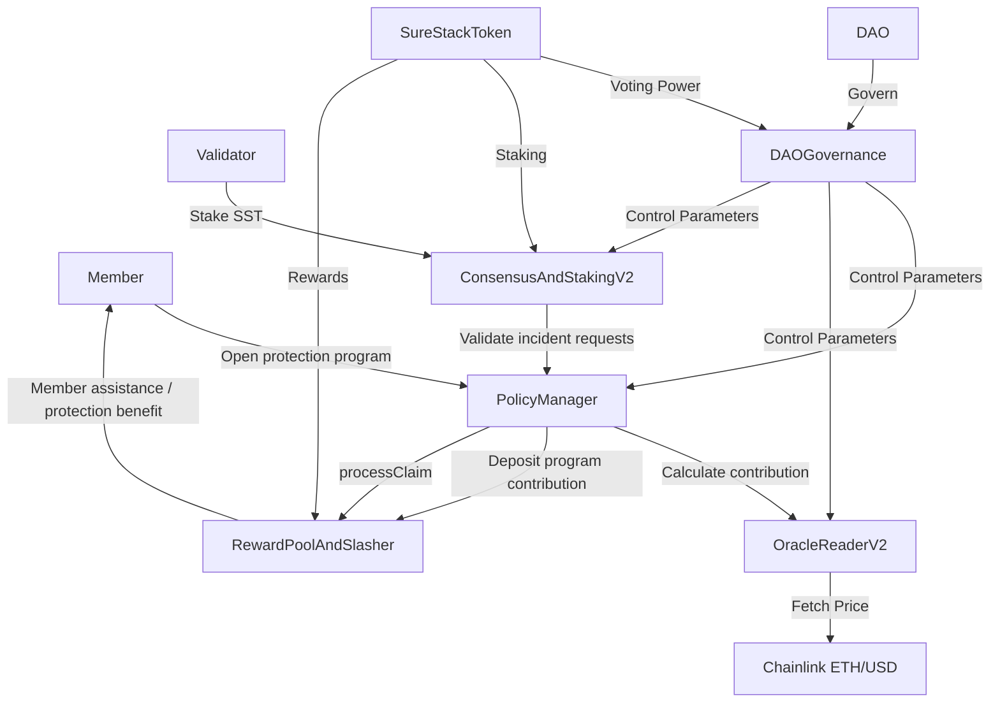

# SureStack Protocol
## Digital Asset Risk Intelligence, Incident Support & Governance Network

**Version 2.1**  
**September 2025**

---

## Cover Page

<div style="text-align: center; page-break-after: always;">

# **SureStack Protocol**

## **Digital Asset Risk Intelligence, Incident Support & Governance Network**

### **Technical Whitepaper v2.1** *(positioning refreshed 2026 — see disclaimer below)*

---

**September 2025**

**Network:** Ethereum Sepolia Testnet  
**Chain ID:** 11155111

---

**SureStack Technology**  
*Building the Future of Decentralized Risk Management*

</div>

---

## Positioning & disclaimer (2026)

**Public and investor-facing positioning:** SureStack is an **AI-powered digital asset risk intelligence and incident support** platform. This document describes on-chain **membership protection programs**, **incident requests**, **member assistance**, and **incident protection limits** for transparency and technical accuracy on the Sepolia testnet.

**Not a licensed carrier:** SureStack is **not** positioned as a licensed **insurer** or **carrier** until any underwriting / reinsurance structure and licensed partnerships are finalized and disclosed. Where legacy wording appears (for example “insurance,” “claim,” or “payout”), it may reflect **historical narrative** or **immutable contract / event names** (`PolicyManager`, `processClaim`, `ClaimProcessed`, etc.)—those identifiers are kept for engineering traceability, not as a retail insurance solicitation.

**Future regulated paths:** If SureStack or partners introduce **licensed carrier** products, they will be described separately with appropriate disclosures. Roadmap items that mention pooled “coverage” refer to **protocol risk architecture**, not an offer of insurance from SureStack as carrier.

---

## Table of Contents

1. [Abstract](#abstract)
2. [Executive Summary](#1-executive-summary)
3. [Introduction](#2-introduction)
4. [Protocol Architecture](#3-protocol-architecture)
5. [Smart Contracts](#4-smart-contracts)
6. [Tokenomics](#5-tokenomics)
7. [Risk Management](#6-risk-management)
8. [Validator Consensus](#7-validator-consensus)
9. [DAO Governance](#8-dao-governance)
10. [Oracle Integration](#9-oracle-integration)
11. [Frontend Architecture](#10-frontend-architecture)
12. [Security & Audits](#11-security--audits)
13. [Roadmap](#12-roadmap)
14. [Conclusion](#13-conclusion)
15. [Appendices](#14-appendices)

---

## Abstract

### The Volatility Revolution in Crypto Risk

The **SureStack Protocol** is a DeFi-native **risk intelligence and incident-support** stack that integrates real-time market volatility into both risk scoring and **program contribution** pricing. While many systems rely on static models updated daily or weekly, our protocol adjusts risk scores and contributions **every 30 seconds** based on live Chainlink data.

**Our Three Pillars of Differentiation:**

1. **Real-Time Volatility Integration**: Continuous monitoring via `OracleReaderV2`
2. **Dynamic risk pricing:** Program contributions calculated on-chain using volatility factor
3. **Full Protocol Transparency**: All 8 contracts deployed, verified, and open-source

This combination positions **SureStack** as a transparent, capital-efficient **digital asset risk intelligence** layer in DeFi—with on-chain **incident support** mechanics for eligible **protection benefits** (subject to program terms and incident protection limits).

The **SureStack Protocol** introduces a revolutionary approach to cryptocurrency transaction risk assessment by leveraging decentralized consensus, tokenized incentives, and advanced risk modeling. Through the **SST token**, validators stake capital to provide accurate risk assessments, creating a self-regulating ecosystem where precision is rewarded and inaccuracy is penalized.

This whitepaper outlines the technical architecture, economic model, and governance framework that enables transparent, scalable, and reliable **risk intelligence** and **incident support** workflows for institutions, protocols, and members.

---

## 1. Executive Summary

SureStack Protocol is a **decentralized risk intelligence, incident support, and governance network** built on Ethereum, designed to provide transparent, on-chain **membership protection programs** with dynamic program-contribution calculation, validator-based consensus, and DAO-governed operations—**not** a licensed **carrier** offering until any such structure is finalized and disclosed.

### Key Features

- **8 Production-Ready Smart Contracts** deployed on Sepolia testnet
- **Real-Time Chainlink Oracle Integration** with 30-second volatility updates
- **Dynamic program contribution calculation** based on live market conditions
- **Validator Staking System** with tier-based rewards (Community, Regular, Institutional)
- **OpenZeppelin DAO Governance** with proposal creation, voting, and execution
- **Cyberpunk "Risk Oracle Control Room" Frontend** with live data visualization
- **On-chain incident support processing** with automatic **member assistance** distribution (within **incident protection limits** and program terms)

### Protocol Status

- **Network:** Sepolia Testnet (Chain ID: 11155111)
- **Deployment Status:** ✅ 85% Complete POC
- **Core Functionality:** ✅ Fully Operational
- **Frontend:** ✅ Production-Ready
- **Security:** ✅ OpenZeppelin Contracts v5.0.0

---

## 2. Introduction

### 2.1 Problem Statement

Traditional risk-transfer and legacy insurance markets suffer from:
- **Opacity** in pricing and **incident support** processing
- **Centralized control** limiting access and fairness
- **Slow dispute resolution** with manual verification
- **Lack of transparency** in risk assessment
- **High barriers to entry** for new participants

### 2.2 Solution: SureStack Protocol

SureStack Protocol addresses these issues by:
- **On-chain transparency:** All **protection programs**, program contributions, and **incident support** events are publicly verifiable
- **Decentralized governance:** DAO-controlled parameters and upgrades
- **Automated processing:** Smart contract-based **incident request** verification and **member assistance** transfers
- **Real-Time Risk Assessment:** Chainlink oracle integration for live market data
- **Validator Consensus:** Distributed network of validators for risk validation
- **Dynamic pricing:** Program contributions adjust automatically based on volatility and risk factors

### 2.3 Core Principles

1. **Transparency:** All operations are on-chain and publicly auditable
2. **Decentralization:** No single point of control or failure
3. **Automation:** Smart contracts handle **protection program** creation, program-contribution calculation, and **incident support** flows (contract identifiers such as `PolicyManager` / `processClaim` remain for technical compatibility)
4. **Real-Time Data:** Live oracle feeds ensure accurate risk assessment
5. **Community Governance:** Token holders control protocol parameters

---

## 3. Protocol Architecture

### 3.1 System Overview

SureStack Protocol consists of **8 core smart contracts** working together to provide a complete risk coverage ecosystem:



### 3.2 Contract Interaction Flow

1. **Protection program creation:**
   - User calls `PolicyManager.createPolicy()` *(on-chain name; user-facing: membership protection program)*
   - Contract queries `OracleReaderV2` for current price and volatility
   - Program contribution calculated dynamically using `calculatePremiumUSD()`
   - SST deposited into `RewardPoolAndSlasher` as the program contribution
   - Program stored on-chain with unique ID

2. **Incident support processing:**
   - Member submits an **incident request** via `PolicyManager.processClaim()` *(immutable function name)*
   - Validators verify the request through `ConsensusAndStakingV2`
   - If consensus reached, `RewardPoolAndSlasher` distributes **member assistance** up to the **incident protection limit**
   - `ClaimProcessed` event emitted for audit trail *(event name retained for compatibility)*

3. **Validator Operations:**
   - Validators stake SST tokens via `ConsensusAndStakingV2.stake()`
   - Validators participate in consensus rounds
   - Rewards distributed based on accuracy via `RewardPoolAndSlasher`
   - Slashing applied for malicious behavior

4. **DAO Governance:**
   - Token holders create proposals via `DAOGovernance.propose()`
   - Voting occurs with SST token voting power
   - Successful proposals queued in `TimelockController`
   - Executed after timelock delay

---

## 4. Smart Contracts

### 4.1 Contract Addresses (Sepolia Testnet)

| Contract | Address | Status | Explorer |
|----------|---------|--------|----------|
| **SureStackToken (SST)** | `0x835fec04058Fdf3FddD1357730849328E863E55C` | ✅ Deployed | [View](https://sepolia.etherscan.io/address/0x835fec04058Fdf3FddD1357730849328E863E55C) |
| **ConsensusAndStakingV2** | `0xE4FDE3D1017758E5b32e8010B0843398bDFF9C57` | ✅ Deployed | [View](https://sepolia.etherscan.io/address/0xE4FDE3D1017758E5b32e8010B0843398bDFF9C57) |
| **RewardPoolAndSlasher V2** | `0x6fCc339Af4439e76C788493FaF48cA969B63d1a5` | ✅ Deployed | [View](https://sepolia.etherscan.io/address/0x6fCc339Af4439e76C788493FaF48cA969B63d1a5) |
| **DAOGovernance** | `0xAD9fC360E128531d765D59ee0567D5390C4AacBE` | ✅ Deployed | [View](https://sepolia.etherscan.io/address/0xAD9fC360E128531d765D59ee0567D5390C4AacBE) |
| **PolicyManager** | `0xc958Eb5C6076F666452c0B8233134648b048A7ca` | ✅ Deployed | [View](https://sepolia.etherscan.io/address/0xc958Eb5C6076F666452c0B8233134648b048A7ca) |
| **OracleReaderV2** | `0x1B081326b7C36f949F7EE4d801361E1d2c9E67d1` | ✅ Deployed | [View](https://sepolia.etherscan.io/address/0x1B081326b7C36f949F7EE4d801361E1d2c9E67d1) |
| **TimelockController** | `0xc21AA00ea234b27e53416D8279239088B8d51a28` | ✅ Deployed | [View](https://sepolia.etherscan.io/address/0xc21AA00ea234b27e53416D8279239088B8d51a28) |
| **Chainlink ETH/USD** | `0x694AA1769357215DE4FAC081bf1f309aDC325306` | ✅ External | [View](https://sepolia.etherscan.io/address/0x694AA1769357215DE4FAC081bf1f309aDC325306) |

### 4.2 Contract Specifications

#### 4.2.1 SureStackToken (SST)

**Standard:** ERC20 with voting power (ERC20Votes)

**Key Features:**
- Total supply: Configurable at deployment
- Voting power: 1 token = 1 vote
- Delegation: Token holders can delegate voting power
- Transfer restrictions: None (standard ERC20)

**Functions:**
- `transfer()` / `transferFrom()`: Standard ERC20 transfers
- `delegate()`: Delegate voting power to another address
- `balanceOf()`: Get token balance
- `getVotes()`: Get voting power at a specific block

#### 4.2.2 PolicyManager

**Purpose:** Core contract for **protection program** lifecycle, program-contribution calculation, and **incident support** (`PolicyManager` name retained on-chain)

**Key Features:**
- Dynamic program-contribution calculation based on oracle data
- On-chain **protection program** storage
- Integration with RewardPool for **member assistance** transfers (within **incident protection limits**)
- Oracle data validation (staleness checks)

**Key Functions:**
```solidity
function createPolicy(uint256 _coverageLimitUSD, uint8 _coveragePercent) 
    external returns (uint256 policyId)

function calculatePremiumUSD(uint256 _coverageLimitUSD, uint8 _coveragePercent) 
    public view returns (uint256 premiumUSD)

function processClaim(uint256 _policyId, uint256 _lossEventValueUSD) 
    external nonReentrant
```

**Premium Formula:**
```
premium = baseCoverage × (baseRate + volatilityFactor) / PRECISION
where:
  baseCoverage = coverageLimitUSD × coveragePercent / 100
  baseRate = 2% (governance-controlled)
  volatilityFactor = calculated from OracleReaderV2
```

#### 4.2.3 OracleReaderV2

**Purpose:** Multi-oracle support with volatility calculation and data validation

**Key Features:**
- Chainlink AggregatorV3Interface integration
- Volatility factor calculation (percentage change over rounds)
- Data staleness detection
- Multi-feed support (ETH/USD, BTC/USD, Volatility)

**Key Functions:**
```solidity
function getLatestPrice() 
    public view returns (int256 price, uint8 decimals, uint80 roundId, uint256 updatedAt)

function getVolatilityFactor(FeedType _feedType) 
    public view returns (int256 volatilityFactor)

function isDataFresh(FeedType _feedType) 
    public view returns (bool isFresh, uint256 age)

function updateRoundData(FeedType _feedType) 
    external
```

**Volatility Calculation:**
```
volatilityFactor = ((currentPrice - previousPrice) / previousPrice) × PRECISION
Returns: int256 scaled to 1e8 (positive = increase, negative = decrease)
```

#### 4.2.4 ConsensusAndStakingV2

**Purpose:** Validator registration, staking, and consensus mechanism

**Key Features:**
- Tier-based staking (Community, Regular, Institutional)
- Weighted median consensus algorithm
- Accuracy tracking and rewards
- Slashing for misbehavior

**Staking Tiers:**

| Tier | Minimum Stake | Reward Multiplier | Status |
|------|---------------|-------------------|--------|
| **Community** | 1,000 SST | 1.0x | ✅ Active |
| **Regular** | 10,000 SST | 1.5x | ✅ Active |
| **Institutional** | 100,000 SST | 2.0x | ✅ Active |

**Key Functions:**
```solidity
function stake(uint256 _amount) external nonReentrant
function requestUnstake(uint256 _amount) external
function withdrawUnstakedFunds() external
function getValidatorStats(address _validator) 
    public view returns (ValidatorStats memory)
```

#### 4.2.5 RewardPoolAndSlasher V2

**Purpose:** Reward distribution, slashing, and treasury management

**Key Features:**
- Reward distribution to validators
- Slashing mechanism for malicious validators
- **Protection-program member assistance** distribution (within limits)
- Treasury routing (DAO-controlled)

**Key Functions:**
```solidity
function distributeRewards(address[] memory _validators, uint256[] memory _amounts) 
    external onlyConsensus

function slashValidator(address _validator, uint256 _amount) 
    external onlyConsensus

function distributeClaim(uint256 _amount) 
    external onlyPolicyManager

function topUpRewardPool(uint256 _amount) 
    external
```

#### 4.2.6 DAOGovernance

**Purpose:** OpenZeppelin Governor-based DAO for protocol governance

**Key Features:**
- Proposal creation and voting
- Token-based voting power (SST)
- Timelock execution delay
- Quorum and voting period controls

**Governance Parameters:**
- **Voting Period:** 7 days (configurable)
- **Proposal Threshold:** 1% of total supply (configurable)
- **Quorum:** 4% of total supply (configurable)
- **Timelock Delay:** 2 days (configurable)

**Key Functions:**
```solidity
function propose(address[] memory targets, uint256[] memory values, 
    bytes[] memory calldatas, string memory description) 
    public returns (uint256 proposalId)

function castVote(uint256 proposalId, uint8 support) 
    public returns (uint256 balance)

function queue(uint256 proposalId) 
    public

function execute(uint256 proposalId) 
    public payable
```

#### 4.2.7 TimelockController

**Purpose:** Delayed execution of DAO proposals for security

**Key Features:**
- Minimum delay: 2 days (configurable)
- Role-based access control
- Batch operations support

---

## 5. Tokenomics

### 5.1 Token Distribution

**Total Supply:** Configurable at deployment

**Distribution:**

| Category | Allocation | Vesting | Purpose |
|----------|------------|---------|---------|
| **Founding Team** | 15% | 4-year vesting, 1-year cliff | Team incentives |
| **Early Investors** | 15% | Milestone-based vesting | Early funding |
| **Treasury (DAO)** | 10% | DAO-controlled | Operations, audits, R&D |
| **Ecosystem Incentives** | 25% | Immediate | Grants, staking, integrations |
| **Public & Community** | 25% | Immediate | Open staking, **protection program** participation |
| **Liquidity & Market Ops** | 10% | Immediate | Market stability, DEX liquidity |

### 5.2 Token Utility

**SST (SureStack Token) serves multiple functions:**

1. **Voting Power:** 1 SST = 1 vote in DAO governance
2. **Staking:** Validators stake SST to participate in consensus
3. **Program contribution:** Users pay SST **program contributions** (historically referred to as premiums in contract math)
4. **Rewards:** Validators earn SST rewards for accurate assessments
5. **Slashing:** Malicious validators lose staked SST

### 5.3 Economic Mechanisms

#### 5.3.1 Program contribution flow

```
User program contribution → PolicyManager → RewardPoolAndSlasher
                                    ↓
                            Member assistance / protection benefits
                            Validator Rewards
                            Treasury (DAO-controlled)
```

#### 5.3.2 Reward Distribution

- **Validator Rewards:** Distributed based on accuracy and stake amount
- **Tier Multipliers:** Higher tiers earn more rewards per stake
- **Slashing:** Misbehaving validators lose staked tokens

#### 5.3.3 APY Calculation

**Formula:**
```
APY = (ProtocolFees × AccuracyFactor) / TotalStaked × 365 days
```

**Example:**
- Protocol Fees: 30,000 SST/month
- Accuracy Factor: 95%
- Total Staked: 70,000 SST
- **Monthly APY:** (30,000 × 0.95) / 70,000 = 40.7%
- **Annual APY:** 40.7% × 12 = 488.4%

---

## 6. Risk Management

### 6.1 Dynamic program contribution calculation

Program contributions (contract: `premiumUSD` / `calculatePremiumUSD`) are calculated in real time based on:

1. **Base Rate:** 2% (governance-controlled)
2. **Volatility Factor:** Calculated from OracleReaderV2
3. **Coverage Amount:** User-specified coverage limit
4. **Coverage Percentage:** 0-100% of coverage limit

**Formula:**
```solidity
premiumUSD = (coverageLimitUSD × coveragePercent / 100) × 
             (baseRate + volatilityFactor) / PRECISION
```

### 6.2 Risk Assessment

**Risk Score Calculation:**
```
Risk Score = Volatility × 20 (capped at 100)
where:
  Volatility = |getVolatilityFactor()| / 1e8 × 100
```

**Risk Levels:**
- **Low Risk (0-39):** Safe (cyan glow)
- **Medium Risk (40-69):** Warning (yellow glow)
- **High Risk (70-100):** Critical (red glow, pulse animation)

### 6.3 Incident support processing

**Process:**
1. Member submits an **incident request** with loss event value (`processClaim`)
2. Validators verify the request through consensus
3. If consensus reached, RewardPool distributes **member assistance** (subject to **incident protection limits**)
4. `ClaimProcessed` event emitted for audit trail *(event name retained for compatibility)*

**Requirements:**
- **Protection program** must be active
- Loss event value must exceed **incident request** trigger threshold (20% default)
- Sufficient funds in RewardPool

---

## 7. Validator Consensus

### 7.1 Validator Registration

Validators must:
1. Stake minimum SST tokens (1,000 for Community tier)
2. Register via `ConsensusAndStakingV2.registerValidator()`
3. Participate in consensus rounds

### 7.2 Consensus Mechanism

**Weighted Median Algorithm:**
- Validators submit risk assessments
- Assessments weighted by stake amount
- Median value selected as consensus score
- Validators within threshold earn rewards
- Validators outside threshold may be slashed

### 7.3 Reward Distribution

**Rewards calculated based on:**
- **Stake Amount:** Higher stake = more rewards
- **Tier Multiplier:** Institutional (2.0x) > Regular (1.5x) > Community (1.0x)
- **Accuracy:** Validators closer to consensus earn more

### 7.4 Slashing Mechanism

**Slashing triggers:**
- Malicious behavior detection
- Consistent deviation from consensus
- Failure to participate in rounds

**Slashing amount:** Configurable by governance (default: 10% of stake)

---

## 8. DAO Governance

### 8.1 Governance Structure

**OpenZeppelin Governor Pattern:**
- **Governor:** Proposal creation and voting
- **Timelock:** Delayed execution for security
- **Token:** SST for voting power

### 8.2 Proposal Lifecycle

1. **Creation:** Token holder creates proposal (requires 1% threshold)
2. **Active:** Voting period begins (7 days default)
3. **Succeeded:** Proposal passes quorum and majority vote
4. **Queued:** Proposal queued in Timelock (2 days delay)
5. **Executed:** Proposal executed after timelock delay

### 8.3 Governance Parameters

**Configurable via DAO proposals:**
- Base program-contribution rate (contract: base premium rate)
- Maximum volatility factor
- **Incident request** trigger threshold
- Validator staking requirements
- Reward distribution rates
- Slashing thresholds

### 8.4 Voting Power

**Calculation:**
```
Voting Power = SST Balance + Delegated Votes
```

**Vote Types:**
- **For (1):** Support proposal
- **Against (0):** Oppose proposal
- **Abstain (2):** Neutral vote

---

## 9. Oracle Integration

### 9.1 Chainlink Integration

**Primary Feed:** ETH/USD Price Feed (Sepolia)
- **Address:** `0x694AA1769357215DE4FAC081bf1f309aDC325306`
- **Update Frequency:** ~30 seconds
- **Decimals:** 8

### 9.2 OracleReaderV2 Features

**Multi-Oracle Support:**
- ETH/USD feed (primary)
- BTC/USD feed (future)
- Volatility feed (future)

**Data Validation:**
- Staleness detection (max age: 6 hours default)
- Deviation threshold (5% default)
- Round data tracking for volatility

**Volatility Calculation:**
```solidity
volatilityFactor = ((currentPrice - previousPrice) / previousPrice) × 1e8
```

### 9.3 Real-Time Updates

**Frontend Integration:**
- 30-second polling for price updates
- WebSocket fallback for governance events
- Automatic RPC failover (Infura → Alchemy → Public)

**Live Metrics:**
- ETH/USD price
- Volatility percentage
- Risk score (0-100)
- Price delta (24h change)

---

## 10. Frontend Architecture

### 10.1 Technology Stack

**Core Framework:**
- React 18.2.0
- Vite 5.4.21
- React Router 7.9.5

**Web3 Integration:**
- ethers.js 6.15.0
- MetaMask wallet connection
- WebSocket + HTTP polling

**UI/UX:**
- Tailwind CSS 3.4.1
- Framer Motion 12.23.24
- Recharts 2.15.4
- Three.js 0.181.0

### 10.2 Cyberpunk "Risk Oracle Control Room" Theme

**Design Philosophy:**
- Dark void background (#0a0a0f)
- Neon color palette (risk: #ff2d55, safe: #00f5ff, warning: #ffb800)
- Glassmorphic cards with scanline effects
- Real-time data visualization
- Animated backgrounds responsive to market data

**Key Components:**
- **RiskTicker:** Live volatility, risk score, and price display
- **HolographicCard:** Risk-based glow cards with animations
- **RiskRadar:** Radial risk gauge with live data
- **NeuroGridBackground:** Three.js animated grid responding to price changes
- **ProposalTimeline:** Vertical timeline for governance proposals

### 10.3 Real-Time Data Synchronization

**Update Frequency:**
- Oracle data: 30 seconds
- Governance events: WebSocket (real-time) + 1-minute polling fallback
- Validator metrics: 15 seconds
- Treasury balances: 15 seconds

**Data Sources:**
- Chainlink ETH/USD feed
- OracleReaderV2.getVolatilityFactor()
- PolicyManager.getGlobalRisk()
- ConsensusAndStakingV2.getValidatorStats()
- DAOGovernance proposals and votes

---

## 11. Security & Audits

### 11.1 Security Measures

**OpenZeppelin Contracts:**
- All contracts use battle-tested OpenZeppelin v5.0.0
- ReentrancyGuard on critical functions
- Pausable for emergency stops
- Ownable for initial setup
- SafeERC20 for token transfers

**Access Control:**
- Role-based permissions (onlyConsensus, onlyPolicyManager, onlyGovernance)
- Timelock for DAO proposals
- Multi-sig support (via Timelock)

**Oracle Security:**
- Staleness checks (max age validation)
- Deviation thresholds
- Multi-round data tracking

### 11.2 Known Limitations

**Current POC Status:**
- Some modifiers temporarily disabled for testing
- Simplified volatility calculation (production would use historical data)
- Limited oracle feed support (ETH/USD only)

**Future Improvements:**
- Historical price data integration
- Multi-oracle aggregation
- Advanced risk modeling
- Formal verification

### 11.3 Audit Status

**Current:** POC deployed on Sepolia testnet  
**Planned:** Full security audit before mainnet deployment

---

## 12. Roadmap

### Phase 1: POC Deployment (✅ Complete)
- [x] Deploy 8 core contracts to Sepolia
- [x] Integrate Chainlink oracle
- [x] Build frontend dashboard
- [x] Implement validator staking
- [x] DAO governance setup

### Phase 2: Production Hardening (🔄 In Progress)
- [ ] Full security audit
- [ ] Historical volatility calculation
- [ ] Multi-oracle aggregation
- [ ] Advanced risk modeling
- [ ] Mobile app (React Native)

### Phase 3: Mainnet Launch (📅 Q1 2026)
- [ ] Mainnet deployment
- [ ] Liquidity pool setup
- [ ] Token distribution
- [ ] Validator onboarding
- [ ] Public launch

### Phase 4: Expansion (📅 Q2-Q4 2026)
- [ ] Multi-chain support (Polygon, Arbitrum)
- [ ] **Additional protection program types** / risk modules (may involve **licensed carrier** partners where regulated products are offered)
- [ ] Institutional partnerships
- [ ] Advanced analytics dashboard

---

## 13. Conclusion

SureStack Protocol represents a **paradigm shift** in decentralized risk coverage, combining:

- **Transparency:** All operations on-chain and auditable
- **Automation:** Smart contract-based processing
- **Real-Time Data:** Live oracle integration
- **Community Governance:** DAO-controlled parameters
- **Validator Consensus:** Distributed risk validation

With **8 production-ready contracts** deployed on Sepolia and a **cyberpunk-themed frontend** providing real-time risk monitoring, SureStack Protocol is positioned as a leading **AI-powered digital asset risk intelligence and incident support** stack for DeFi—**not** as a licensed **insurer** until any such offering is separately structured and disclosed.

**Current Status:** 85% Complete POC, ready for security audit and mainnet preparation.

---

## 14. Appendices

### Appendix A: Contract ABIs

All contract ABIs are available in:
- `src/abis/` (frontend)
- `shared/abi/` (shared)
- `artifacts/contracts/` (compiled)

### Appendix B: Environment Variables

**Frontend (.env.local):**
```env
VITE_SEPOLIA_RPC=https://sepolia.infura.io/v3/...
VITE_CHAINLINK_ETHUSD=0x694AA1769357215DE4FAC081bf1f309aDC325306
VITE_SURE_STACK_TOKEN_ADDRESS=0x835fec04058Fdf3FddD1357730849328E863E55C
VITE_CONSENSUS_STAKING_V2_ADDRESS=0xE4FDE3D1017758E5b32e8010B0843398bDFF9C57
VITE_REWARD_POOL_ADDRESS=0x6fCc339Af4439e76C788493FaF48cA969B63d1a5
VITE_DAO_GOVERNANCE_ADDRESS=0xAD9fC360E128531d765D59ee0567D5390C4AacBE
VITE_POLICY_MANAGER_ADDRESS=0xc958Eb5C6076F666452c0B8233134648b048A7ca
VITE_ORACLE_READER_ADDRESS=0x1B081326b7C36f949F7EE4d801361E1d2c9E67d1
```

### Appendix C: Key Formulas

**Premium Calculation:**
```
premiumUSD = baseCoverage × (baseRate + volatilityFactor) / PRECISION
```

**Volatility Factor:**
```
volatilityFactor = ((currentPrice - previousPrice) / previousPrice) × 1e8
```

**Risk Score:**
```
riskScore = min(|volatilityFactor| / 1e8 × 100 × 20, 100)
```

**APY:**
```
APY = (ProtocolFees × AccuracyFactor) / TotalStaked × 365
```

### Appendix D: References

- **OpenZeppelin Contracts:** https://docs.openzeppelin.com/contracts/5.x/
- **Chainlink Oracles:** https://docs.chain.link/data-feeds
- **OpenZeppelin Governor:** https://docs.openzeppelin.com/contracts/5.x/api/governance
- **Ethereum Sepolia:** https://sepolia.dev/

### Appendix E: Contact & Resources

**Protocol:** SureStack Protocol  
**Network:** Sepolia Testnet  
**Website:** [To be announced]  
**Documentation:** [GitHub Repository]  
**Support:** [To be announced]

---

**Document Version:** 2.1  
**Last Updated:** September 2025 *(positioning disclaimer added 2026)*  
**Status:** Production-Ready POC (85% Complete)

---

*This whitepaper is a living document and will be updated as the protocol evolves.*

